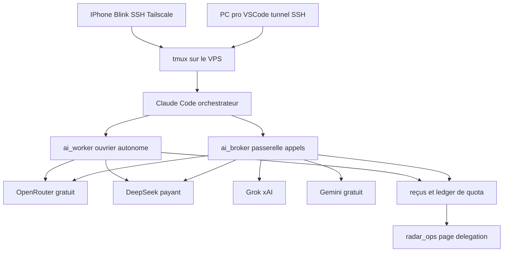
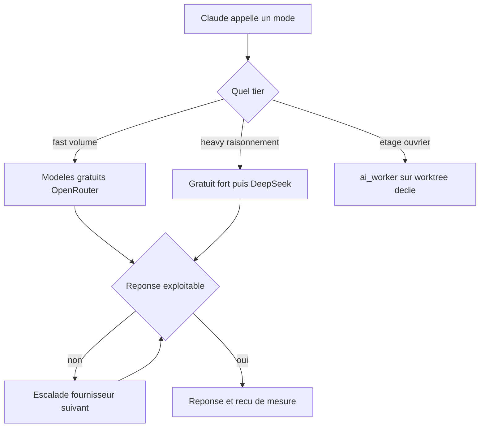

# Plan — Délégation multi-modèles pour économiser les tokens Claude

Version 1 — 25/09/2026. À valider avant toute implémentation.

## 1. Objectif

Faire porter par des modèles gratuits (puis par des modèles payants très bon marché
pour le raisonnement) tout le travail à faible valeur ajoutée, en gardant Claude 
comme **unique interlocuteur** et **seul responsable de ce qui part en commit**.

Contraintes actées avec l'utilisateur :

| Contrainte | Décision |
|---|---|
| Écrire à un seul interlocuteur | Claude Code CLI reste la seule interface ; les autres modèles ne sont jamais contactés à la main |
| Deux étages de délégation | Passerelle d'appels sans état pour le volume + ouvrier autonome pour les chantiers longs |
| Volume gratuit | OpenRouter, palier 1000 req/jour débloqué par un crédit unique de 10 $ (jamais consommé) |
| Raisonnement économique | DeepSeek pay-as-you-go en second recours quand aucun gratuit n'est assez bon |
| Troisième source | xAI Grok, crédit à déposer, à confirmer au moment de l'intégration |
| Quatrième source | Gemini gratuit, déjà intégré, reste en cascade |
| Interface PC | VSCode + tunnel SSH vers le VPS, [`tmux`](CLAUDE.md:5) |
| Interface iPhone | Terminal SSH mobile + Tailscale, attaché au **même** `tmux` que le PC |
| Déploiement | GitHub → Actions → VPS, inchangé |

Le point qui a échoué jusqu'ici — Claude ne délègue pas assez, et le mode
`read` n'est jamais appelé — est traité comme un problème de **mécanique**, pas
de bonne volonté : ce qui doit arriver systématiquement passe par un hook, pas
par le jugement du modèle au moment de l'action.

## 2. Architecture cible

Routage interne de la passerelle :

## 3. Pourquoi l'architecture actuelle ne suffit pas

Constats établis sur le code réel :

- [`scripts/ai_query.py`](../scripts/ai_query.py:494) est mono-fournisseur (Gemini
  uniquement) et mono-API (Google AI Studio). Les 503 à répétition et les quotas
  étroits viennent de là : une seule source, un seul palier.
- Le mode `read` existe ([`scripts/ai_query.py`](../scripts/ai_query.py:135)) mais
  n'est **jamais déclenché** : rien ne l'impose, il dépend d'une décision du modèle
  au milieu d'une session.
- Le gate [`scripts/hooks/gemini_gate.py`](../scripts/hooks/gemini_gate.py:140)
  vérifie qu'un reçu *existe*, pas qu'il est économiquement pertinent : il est
  satisfait par un appel à 3 caractères de prompt (déjà partiellement corrigé par
  `GATE_MIN_PROMPT_CHARS`), et il ignore la répartition réelle entre tiers.
- La sortie `code` échoue proprement sur `--check-syntax`
  ([`scripts/ai_query.py`](../scripts/ai_query.py:776)) mais **ne renvoie jamais
  l'erreur au modèle** : pas de boucle de réparation, alors que c'est le geste le
  plus rentable en tokens Claude.
- Le catalogue de modèles est codé en dur
  ([`scripts/ai_query.py`](../scripts/ai_query.py:71)) et ne suit ni les paliers ni
  les modèles nouveaux.

## 4. Composant A — Passerelle multi-fournisseurs

Remplace progressivement [`scripts/ai_query.py`](../scripts/ai_query.py:494) par un
socle fournisseur-agnostique.

### 4.1 Fichiers

- `scripts/ai/__init__.py`
- `scripts/ai/providers.py` — deux familles d'adaptateurs :
  - `OpenAICompatProvider` : couvre OpenRouter, DeepSeek et xAI d'un seul client
    (`POST /chat/completions`, en-tête `Authorization: Bearer`). Paramètres
    spécifiques par provider : URL de base, en-têtes additionnels, nom des champs
    de raisonnement.
  - `GeminiProvider` : réutilise le code v2beta déjà présent (payload
    `generateContent`, `usageMetadata`, `thinkingConfig`).
- `scripts/ai/catalogue.py` + `config/ai_models.json` — catalogue **engendré**, pas
  saisi à la main : `scripts/ai/refresh_models.py` interroge la liste de modèles de
  chaque fournisseur et ne conserve que les gratuits (`:free`, prix nul) plus la
  liste courte payante validée (DeepSeek). Aucun identifiant de modèle n'est écrit
  en dur dans le plan ni dans le code : les noms changent souvent et un nom invalide
  coûte un aller-retour.
- `scripts/ai/quota.py` — ledger `ai_usage.jsonl` + état `ai_quota.json` sous
  `<data>/ops/ai/`, compte par **clé** et par **modèle**, avec la fenêtre de
  réinitialisation propre à chaque fournisseur.
- `scripts/ai/health.py` — disjoncteur par (fournisseur, modèle) : un 429 pose un
  cooldown tiré de `Retry-After` s'il existe, sinon backoff exponentiel ; un 404
  retire le modèle jusqu'au prochain rafraîchissement du catalogue.
- `scripts/ai/router.py` — construit la liste ordonnée de candidats pour un
  (mode, taille de prompt, tier) en écartant quota épuisé et modèles en cooldown.
- `scripts/ai/redact.py` — filtre de masquage appliqué **avant** tout envoi :
  clés, `token=`, `password=`, contenu de `.env`, chemins de secrets. Avec quatre
  fournisseurs au lieu d'un, l'exposition augmente mécaniquement.
- `scripts/ai_broker.py` — point d'entrée CLI, remplace l'usage d'`ai_query.py`.
- [`scripts/ai_query.py`](../scripts/ai_query.py:1) — devient un **alias mince**
  (mêmes arguments, mêmes codes de retour, mêmes noms de reçus) pour que le gate,
  les tests et les skills existants continuent de fonctionner pendant la migration.

### 4.2 Policy de routage

Ordre de préférence, non négociable :

1. Modèle gratuit disposant de quota restant (OpenRouter, puis Gemini gratuit).
2. DeepSeek payant si et seulement si le mode est `reasoning` ou si l'escalade est
   déclenchée par un échec de qualité vérifié (compilation, JSON invalide, test rouge).
3. Jamais Claude pour une tâche déléguable ; jamais de payant silencieux — chaque
   appel payant est estampillé dans le reçu et compte dans un plafond journalier
   (`RADAR_AI_DAILY_PAID_CAP_USD`, dépassement = arrêt, pas de dérive).

### 4.3 Rotation de clés

`OPENROUTER_API_KEY_1..N` et `GEMINI_API_KEY_1..N` lues comme listes. La rotation
s'appuie sur le ledger : la clé la moins utilisée du jour dans la fenêtre passe en
premier. C'est l'extension directe de la stratégie déjà rédigée dans
[`docs/Strategie rotatio clés API.txt`](../docs/Strategie%20rotatio%20clés%20API.txt:1),
appliquée aux fournisseurs d'IA et pas seulement à YouTube.

## 5. Composant B — Ouvrier autonome

`scripts/ai_worker.py` : une boucle d'outils **bornée**, pilotée par un modèle
gratuit, qui exécute un chantier entier et rend un diff à relire.

- **Périmètre** : un `git worktree` dédié (`~/radar-work/.worktrees/worker-<tache>`)
  sur une branche `worker/<tache>`. Il ne peut donc rien casser en place, et Claude
  relit avec un `git diff` ordinaire.
- **Outils exposés** : lire, lister, chercher, écrire un fichier, appliquer un
  patch, lancer une commande d'une liste blanche stricte (`py_compile`,
  `python3 -m unittest`, `git status`, `git diff`). Aucun accès réseau, aucun `git
  commit`, aucun `git push`, aucune écriture dans `~/radar` ni dans `/data`.
- **Bornes dures** : nombre d'étapes, durée maximale, volume de tokens, nombre de
  fichiers modifiables. Atteindre une borne n'est pas un échec silencieux : c'est
  un arrêt avec rapport.
- **Sortie** : un diff unifié, un rapport JSON (ce qui a été tenté, ce qui passe,
  ce qui reste rouge, les commandes exécutées et leurs codes de retour), et
  l'identifiant du modèle qui l'a produit.
- **Escalade** : si la boucle gratuite n'aboutit pas après un nombre d'itérations
  fixé, elle peut être relancée sur DeepSeek pour le même chantier — décision
  explicite, tracée dans le reçu, jamais automatique en début de tâche.
- **Usage type** : page HTML d'une nouvelle fonctionnalité, script intermédiaire,
  durcissement d'un job de fond, tests unitaires d'un module déjà écrit.

Le contrat « aucun correctif gardé sans mesure » du skill
[`script-loop`](../.claude/skills/script-loop/SKILL.md:17) s'applique : l'ouvrier ne
merge rien, il rend un diff.

## 6. Composant C — Refonte des modes et garanties de sortie

| Mode | Statut | Rôle | Garantie de sortie |
|---|---|---|---|
| `pr` | conservé tel quel | commit, corps de PR, note de release | déjà fiable, ne pas régresser |
| `diag` | conservé | diagnostic d'un journal ou d'une trace | 3 sections ORIGINE / CAUSE / PISTE |
| `summary` | conservé | compression de volume | puces bornées |
| `code` | **refondu** | premier jet de code | enveloppe JSON `{explication, code}`, extraction du code, `py_compile`, **boucle de réparation** qui renvoie l'erreur au modèle |
| `test` | **refondu** | premier jet de tests | idem + exécution de la suite ciblée, boucle de réparation |
| `context` | **remplace `read`** | lire et résumer les documents de contexte en début de session | JSON validé, cache disque indexé par empreinte du fichier, jamais relu deux fois |
| `search` | **nouveau** | localiser un document, un script ou un objet de l'environnement | réponse purement locale par défaut, modèle sollicité seulement pour désambiguïser |
| `general` | conservé | tout le reste | — |
| `reasoning` | **nouveau** | tâche qui demande du raisonnement sans être du code | tier payant autorisé d'emblée, tracé comme tel |

Trois mécanismes qui répondent directement aux bonnes pratiques déjà identifiées par
l'utilisateur :

1. **Budget de réflexion piloté** : `--effort low|medium|high` traduit vers le champ
   réel de chaque fournisseur (Gemini `thinkingConfig.thinkingBudget`, OpenRouter et
   xAI champ de raisonnement, DeepSeek `deepseek-reasoner`). Le mapping est
   **configuré**, pas supposé : chaque valeur est vérifiée contre la documentation du
   fournisseur au moment de l'intégration.
2. **Pavage de contexte** : le mode `context` accepte plusieurs documents et les
   envoie en **un seul appel** plutôt qu'un appel par document. C'est le levier
   « maximiser les jetons par appel » pour un quota exprimé en nombre de requêtes.
3. **JSON réellement garanti** : sortie structurée native quand le fournisseur
   l'accepte, sinon validation du schéma puis **un** essai de réparation, puis échec
   explicite. Jamais de JSON à moitié valide écrit sur disque.

## 7. Composant D — Gate, skills et règle projet

- [`scripts/hooks/gemini_gate.py`](../scripts/hooks/gemini_gate.py:140) devient
  `scripts/hooks/delegation_gate.py` : le reçu porte désormais `provider`, `model`,
  `tier` (gratuit ou payant) et `mode`. Le gate continue de bloquer commit, test et
  nouveau module sans reçu récent, et gagne une vérification supplémentaire : un
  reçu `paid` sans justification de mode `reasoning` est signalé dans la télémétrie.
- **Détection d'occasions manquées** : un hook **non bloquant** mesure les cas où
  Claude a lu un gros fichier ou écrit du code sans appel préalable. Le compteur
  alimente le tableau de bord — c'est ce qui répond au « mode read jamais appelé »
  par une mesure, pas par une consigne de plus.
- Le skill [`ask-gemini`](../.claude/skills/ask-gemini/SKILL.md:1) devient `delegate`
  (fournisseur-neutre) ; `ask-gemini` reste comme alias de quelques lignes pour ne
  casser aucune référence existante.
- Corrections de fond dans les skills :
  - l'exemple fautif `radar_web/radar/mon_module.py` devient un chemin absolu sous
    `~/radar-work/`, avec le rappel que les deux checkouts partagent la même
    arborescence (régression réellement survenue, documentée en
    [`CLAUDE.md`](../CLAUDE.md:135) pt 50) ;
  - la garantie JSON est décrite explicitement, plus supposée ;
  - la fin de `scripts/loop/registry.json` :
    [`ai_broker` et `ai_worker`](../scripts/loop/registry.json:32) y entrent, avec
    banc et source d'observations, pour que la boucle d'amélioration les couvre.
- [`CLAUDE.md`](../CLAUDE.md:5) : la RÈGLE N°1 est réécrite en table de routage —
  quel mode pour quelle tâche, quel tier, « gratuit d'abord, DeepSeek ensuite,
  jamais Claude pour X ».

## 8. Composant E — Contexte automatique et télémétrie

- **Contexte de début de session rendu déterministe** : `SessionStart` lit
  `docs/context-manifest.json` (liste des documents de contexte) et lance le mode
  `context` dessus. Un digest compact est injecté dans la session, les résumés
  complets restent en cache disque. Le mode cesse de dépendre d'une décision du
  modèle : c'est ce qui le fait enfin exister.
- **Reçus enrichis** : fournisseur, modèle, tier, jetons, durée, coût estimé pour le
  payant, nombre de tours de réparation, nombre d'éléments pavés, quota restant.
- **Tableau de bord** [`radar_ops/delegation.py`](../radar_ops/delegation.py:215) et
  [`delegation.html`](../radar_ops/templates/delegation.html:1) : répartition par
  fournisseur, quota gratuit consommé du jour par modèle, part gratuit contre payant,
  occasions manquées, modèles en cooldown. Une page de coût permet de voir en un
  coup d'œil si le mois reste à zéro euro.
- La règle de mesure du projet est conservée : les jetons sont ceux **rapportés** par
  les API, jamais une estimation d'économie côté Claude.

## 9. Composant F — Interfaces et exploitation

- **PC** : inchangé, VSCode + tunnel SSH + `tmux`.
- **iPhone** : Tailscale + client SSH mobile, `tmux attach` sur la session existante.
  Une procédure écrite (nom de session, commande d'attache, redimensionnement du
  terminal) est ajoutée à la documentation, plus un contrôle des ACL Tailscale pour
  que le port SSH ne soit joignable que depuis les appareils de l'utilisateur.
- **Secrets** : uniquement dans `~/radar/.env` et dans le `settings.json` hors dépôt.
  [``.env.example`](../.env.example:23) gagne les nouvelles variables
  (`OPENROUTER_API_KEY_*`, `DEEPSEEK_API_KEY`, `XAI_API_KEY`, `GEMINI_API_KEY_*`,
  plafond payant, dossier usage). Aucun secret dans un reçu, un rapport ou un prompt.
- Le contrat [`vps-ops`](../.claude/skills/vps-ops/SKILL.md:18) est étendu : mêmes
  garde-fous, plus l'interdiction d'appeler un fournisseur payant sans le déclarer.

## 10. Sécurité et garde-fous

| Risque | Mesure |
|---|---|
| Fuite de secret vers un tiers | masquage `redact.py` avant envoi + interdiction de piper un `.env` ou un log brut |
| Dérive de coût payant | plafond journalier, arrêt au dépassement, reçu estampillé payant |
| Ouvrier qui casse le dépôt | worktree isolé, liste blanche de commandes, aucune écriture hors périmètre |
| Claude qui reprend la main « par commodité » | gate multi-fournisseurs + mesure des occasions manquées |
| Dépendance à un modèle retiré | catalogue engendré, 404 retire le modèle, disjoncteur santé |

## 11. Points à vérifier avant d'écrire du code

1. Réseau sortant du VPS vers les quatre fournisseurs (OpenRouter, DeepSeek, xAI,
   Google) — un appel de test par fournisseur.
2. Paliers réels et fenêtres de réinitialisation, lus dans la documentation au
   moment de l'intégration — pas supposés depuis ce plan.
3. Crédit unique OpenRouter posé et palier 1000 req/jour effectivement constaté.
4. Crédit xAI et volume gratuit réellement obtenu à l'ouverture du compte.
5. Forme exacte du champ de raisonnement chez chaque fournisseur (un appel trivial
   par fournisseur, relevé verbatim de la réponse).

## 12. Phasage

- **Phase 0 — Mesurer et recenser.** Base de comparaison depuis les reçus existants,
  état des accès et des paliers. Aucune ligne de code produit.
- **Phase 1 — Passerelle multi-fournisseurs.** Socle, catalogue, quota, rotation,
  disjoncteur, routage, alias rétrocompatible, banc.
- **Phase 2 — Modes et skills.** `context`, `search`, `code` avec réparation, JSON
  garanti, budget de réflexion, pavage, gate renommé, skills corrigés.
- **Phase 3 — Ouvrier autonome.** Boucle bornée, worktree, rapport de diff, banc.
- **Phase 4 — Contexte automatique et tableau de bord.** `SessionStart`, reçus
  enrichis, quota rosisibles, occasions manquées.
- **Phase 5 — Interfaces et mise en service.** Documentation iPhone, `.env.example`,
  contrat `vps-ops`, déploiement, puis un chantier réel de bout en bout.

Chaque phase est livrable seule et laisse le système utilisable : à aucun moment on
ne se retrouve avec une passerelle à moitié migrée et un gate cassé.
